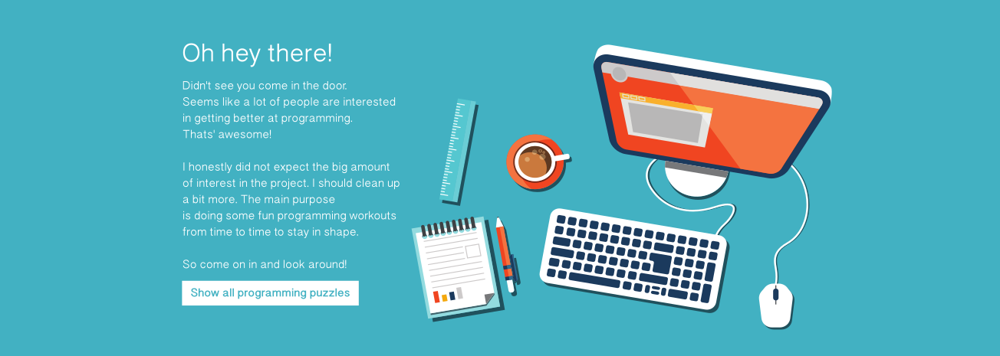

## Oh, hi there!

Didn’t see you come in the door. Seems like a lot of people are interested in
getting better at programming. That’s awesome!

I honestly did not expect the big amount of interest in the project. I should
clean up a bit… If you’d like to help me with that, please send me a mail.
Anyway, the main purpose is doing some fun programming workouts from time to
time to stay in shape. So come on in and look around!

## Contributing

Interested in contributing? Find problems that don’t have solutions yet in the
language of your choice by running the
[find-missing-solutions](find-missing-solutions) script.

For more information see [CONTRIBUTING.md](CONTRIBUTING.md).

## Credits

Currently, this is a collection of the following resources:

  * [blakeembrey/code-problems](https://github.com/blakeembrey/code-problems)
  * [Simeon Willbanks Repo](https://github.com/simeonwillbanks/google-interview-questions/tree/master/questions)
  * [Arden Dertat's posts](http://www.ardendertat.com/2012/01/09/programming-interview-questions/)
  * [jonnii/interview-questions](https://github.com/jonnii/interview-questions)
  * [ofirpicazo/interview-questions](https://github.com/ofirpicazo/interview-questions/tree/master/python)
  * [Google Code Jam Problems](https://code.google.com/codejam/)
  * [Project Euler](https://projecteuler.net/)

The awesome title image was [Designed by Freepik](http://www.freepik.com).

## Statistics

<!--
brew install scc
scc -i bash,c,coffee,cpp,cs,dart,fsx,go,h,hpp,hs,java,jl,js,kt,kts,lol,php,py,pyc,rb,rs,swift,ts problems/
-->

```
───────────────────────────────────────────────────────────────────────────────
Language                 Files     Lines   Blanks  Comments     Code Complexity
───────────────────────────────────────────────────────────────────────────────
Python                     156      5396      631       585     4180       1400
JavaScript                  69      1875      266       228     1381        286
PHP                         27       720       96        10      614         61
CoffeeScript                23       584       74        84      426         72
Rust                        23       919       94        22      803         74
Java                        20       735       92        39      604        128
Kotlin                      20       467       71        26      370         77
C#                          14       527       61        31      435         59
Ruby                        12       215       21        86      108         16
C++                         11       407       42        22      343         60
Go                          11       382       60         4      318         55
BASH                        10       305       33        15      257         48
C                           10       224       41        16      167         41
Haskell                      6        55        9         3       43          4
F#                           5        81       11        19       51          5
C++ Header                   4       268       49         9      210         15
TypeScript                   3        58       15         0       43          6
Dart                         2        53        9         0       44          8
Julia                        2        29        5         2       22          6
C Header                     1        18        6         2       10          0
LOLCODE                      1        30        6         0       24          2
Swift                        1        86        3         7       76          3
───────────────────────────────────────────────────────────────────────────────
Total                      431     13434     1695      1210    10529       2426
───────────────────────────────────────────────────────────────────────────────
Estimated Cost to Develop $319,964
Estimated Schedule Effort 9.950146 months
Estimated People Required 3.809141
───────────────────────────────────────────────────────────────────────────────
```
